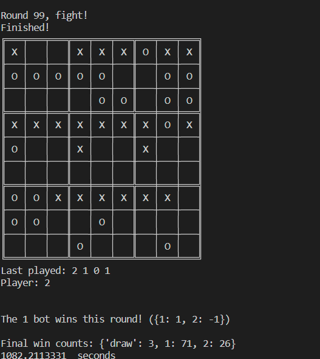
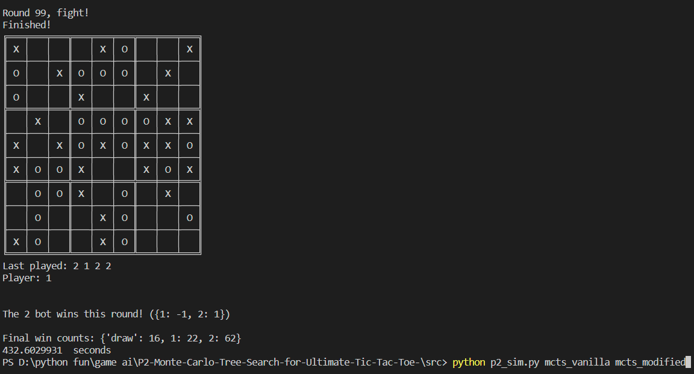

**P2: Monte Carlo Tree Search for Ultimate Tic-Tac-Toe**  
- Team member:  
  - Zhuo Chen
  - Luciano Loma Lorenzana
  
- **Requirement**  
  - - [x] Implement mcts_vanilla.py that uses MCTS with a full, random rollout. mcts_vanilla must beat rollout_bot most of the time.  
       
  - - [ ] Using your existing implementation from mcts_vanilla.py as base code, implement mcts_modified.py with the addition of your own heuristic rollout strategy as an improvement over vanilla MCTS. Optional: You may also adjust other aspects of the tree search, by implementing the variations discussed in class (roulette selection, partial expansion, etc).  
  - Perform the two experiments described below.  
    -  - [ ] Experiment 1 – Tree Size  
       -**100 nodes vs  100 nodes**  
       
    -  - [ ] Experiment 2 – Heuristic Improvement  
  - Extra Credit (Optional):
       - - [ ] Experiment 3 – Time as a Constraint  

- **The modifications done for mcts_modified.py.**  
  - The rollout function is recompiled to select the action when the action changes owned_boxes, otherwise return a random action and run rollout.  
    
  - Idea: From the perspective of longer-term results, the more nodes are tested (more than 100), the winning rate fed back to the nodes will decrease (because the frequency of visiting nodes increases), and it will affect the judgment of the algorithm. But when the tree is large enough and covers almost all possible outcomes, the accuracy of the algorithm increases and a good quality best method is obtained.  

    
